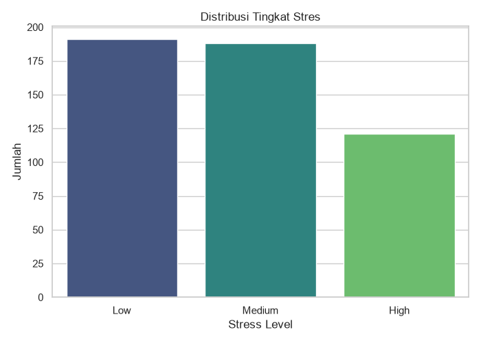
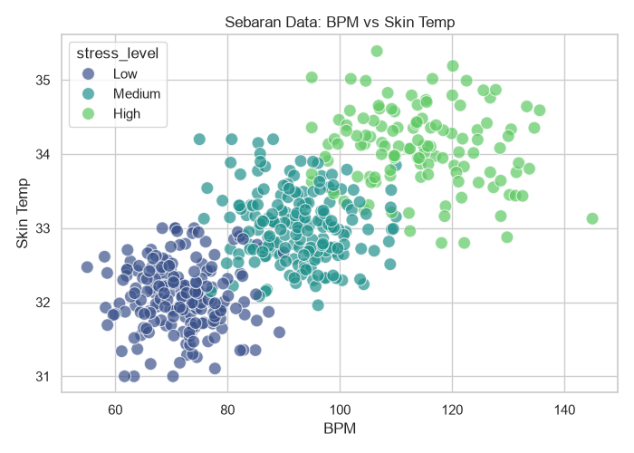
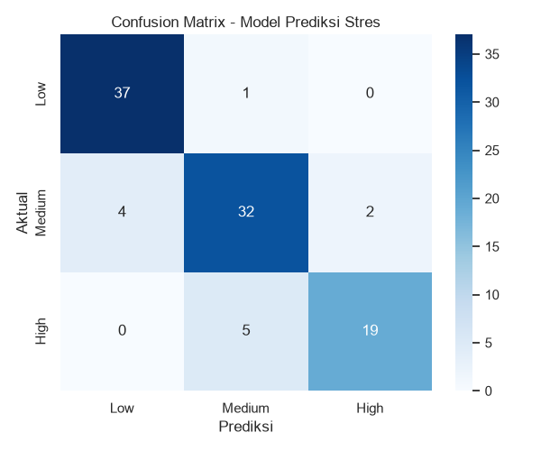

# Stress Prediction from IoT Data (Demo Project)

Project ini merupakan demonstrasi penerapan Machine Learning (**Random Forest Classifier**) untuk memprediksi tingkat stres seseorang berdasarkan parameter fisiologis (Detak Jantung / BPM dan Suhu Kulit).

*Catatan: Dataset yang digunakan adalah data buatan (sintetis) untuk kebutuhan simulasi IoT, bukan data medis untuk diagnosis klinis.*

## 📊 Dataset & Fitur
Data memiliki dua fitur utama:
- **BPM (Beats Per Minute)**: Detak Jantung.
- **Skin Temp**: Suhu permukaan kulit.

Tingkat Stres (Label) dibagi menjadi 3 kategori:
- `Low` (Rendah)
- `Medium` (Sedang)
- `High` (Tinggi)

### Distribusi dan Sebaran Data
Berikut adalah grafik distribusi jumlah data pada setiap kelas stres dan sebaran hubungannya:

## 🤖 Performa Model

Kami menggunakan algoritma **Random Forest** dengan `n_estimators=200` menggunakan `scikit-learn`.
- **Akurasi Model**: ~88%

### Confusion Matrix
Berikut adalah visualisasi keakuratan tebakan model pada saat dievaluasi menggunakan data testing. Angka pada garis diagonal (kiri atas ke kanan bawah) merepresentasikan tebakan yang benar:

## 🛠️ Cara Menggunakan
1. Buka `stress.ipynb` di Jupyter Notebook atau VS Code untuk melihat proses visualisasi dan pelatihannya secara interaktif.
2. File `train_stress_model.py` adalah script Python murni untuk melatih dan menyimpan model ke dalam file `stress_predict_model.joblib`.
3. Model `.joblib` ini bisa langsung diintegrasikan (deploy) ke perangkat atau server IoT untuk memprediksi data sensor secara realtime!
